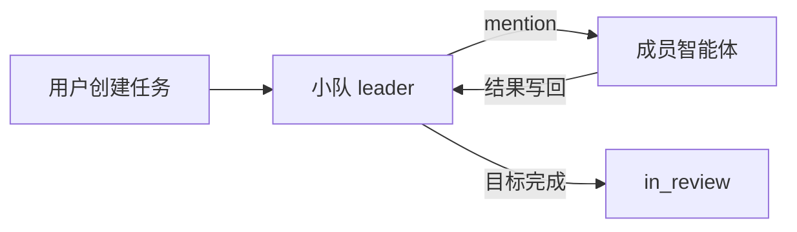

# Multica Mini

[](https://github.com/cunzai97/multica-mini/actions/workflows/smoke.yml)

Multica Mini 是从 Multica 协作模型裁剪出的单机离线运行时。一个静态 C++ 二进制同时
提供任务调度、智能体进程管理、JSON 文件存储、HTTP API 和本地 Web 界面。

它面向 CentOS 7、RHEL 8 及其他 x86_64 Linux，运行程序本身不需要 glibc、Node.js、
Python、Go、Docker、PostgreSQL 或互联网连接。

## 下载并运行

下载仓库中的
[Linux x86_64 离线包](dist/multica-core-offline-0.1.0-linux-x86_64.tar.gz)，然后执行：

```sh
tar -xzf multica-core-offline-0.1.0-linux-x86_64.tar.gz
cd multica-core-offline-0.1.0-linux-x86_64
./start.sh
```

浏览器打开 `http://127.0.0.1:30420`。

也可以克隆仓库后直接运行已构建的二进制：

```sh
git clone https://github.com/cunzai97/multica-mini.git
cd multica-mini
./start.sh
```

`start.sh` 默认把数据保存在当前仓库的 `data/`。服务固定监听
`127.0.0.1`，Web 页面不加载 CDN 或其他在线资源。

## 包含的功能

- 登记智能体的命令、职责和 skill；
- 任务直接分配给智能体；
- 创建包含 leader 和成员的小队；
- leader 通过 mention 派发成员；
- 成员返回结果后重新唤醒 leader；
- 评论时间线、运行记录和任务状态；
- 本地 JSON 持久化；
- 采用 Multica 原作浅色看板布局的纯 HTML、CSS、JavaScript 管理界面；
- 支持亮色、暗色和跟随系统三种界面主题；
- CLI 和本地 JSON API。

主题可在页面右上角切换，偏好只保存在当前浏览器的 `localStorage` 中。主题属于
应用界面设置，不会进入任务提示，也不会写入任何 workflow 或 skill。

## 最小协作流程



智能体命令以 argv 直接执行，不经过 shell。运行时支持替换 `{prompt}`、
`{cwd}`、`{issue_id}` 和 `{agent_id}`。

## 系统兼容性

| 项目 | 状态 |
| --- | --- |
| CPU / OS | Linux x86_64 |
| CentOS 7 / RHEL 8 | 以 musl 静态二进制为目标 |
| 二进制 | ELF static PIE，约 2.1 MiB |
| 离线包 | 约 832 KiB |
| 动态库 | ELF 动态段没有 `NEEDED` 项 |
| 浏览器资源 | 全部包含在 `web/` |
| 外部要求 | 一个浏览器，以及实际处理任务的智能体 CLI |

## 文档

- [完整使用说明](README.zh-CN.md)
- [设计、架构、调度语义和 API](docs/DESIGN.zh-CN.md)

## 验证

```sh
./tests/smoke.sh
./tests/web-smoke.sh
(cd dist && sha256sum -c multica-core-offline-0.1.0-linux-x86_64.tar.gz.sha256)
```

CLI 测试覆盖 leader → worker → leader 闭环；Web 测试覆盖静态页面、智能体、小队、
任务、运行和状态 API。发行包还经过解压直接运行及安装后运行验证。

## 从源码构建

仓库已包含 cpp-httplib 和 nlohmann/json：

```sh
./scripts/build.sh
./scripts/package.sh
```

构建脚本优先选择 musl 交叉编译器，也可以通过 `CXX`、`STRIP` 指定工具链。

## 项目边界

这个版本专注单机离线协作，没有账号、工作区、计费、通知、Chat、Inbox、Autopilot、
Project、外部集成、远程 daemon、对象存储和完整 provider 兼容层。

本项目也没有加入 Plan Mode、Ask Gate 或自动收集 workflow/skill 设计。

## 许可证

本项目基于 [Multica](https://github.com/multica-ai/multica)，完整条款见
[LICENSE](LICENSE)，归属声明见 [NOTICE](NOTICE)。Multica License 包含对第三方托管
服务和嵌入商业产品的附加限制。第三方组件条款见
[THIRD_PARTY_LICENSES](THIRD_PARTY_LICENSES)。
