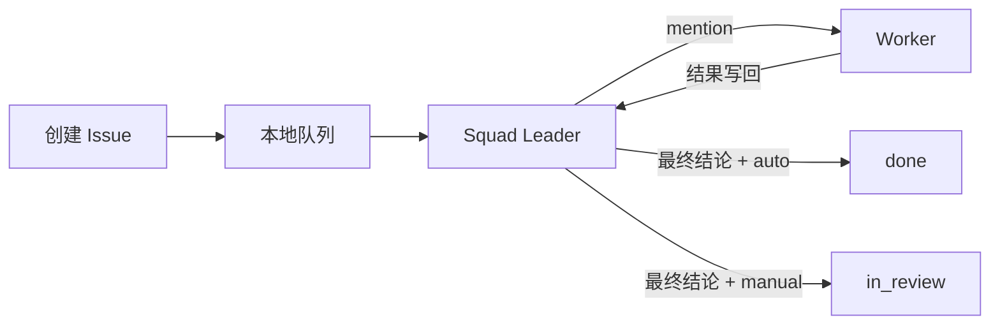

# Multica Mini

[](https://github.com/cunzai97/multica-mini/actions/workflows/smoke.yml)

Multica Mini 是从 Multica 协作模型裁剪出的单机离线多智能体任务工作台。一个静态 C++
二进制同时提供 Agent 进程管理、Squad Leader 调度、JSON 存储、HTTP API 和 Web 界面。

它面向 CentOS 7、RHEL 8 及其他 x86_64 Linux。运行程序本身不需要宿主机 glibc、
Node.js、Python、Go、Docker、PostgreSQL 或互联网连接。实际执行任务的 Agent CLI
及其模型连接由使用者配置。

## 下载并运行

下载仓库中的
[Linux x86_64 离线包](dist/multica-core-offline-0.2.0-linux-x86_64.tar.gz)，然后执行：

```sh
tar -xzf multica-core-offline-0.2.0-linux-x86_64.tar.gz
cd multica-core-offline-0.2.0-linux-x86_64
./start.sh
```

浏览器打开 `http://127.0.0.1:30420`。需要后台常驻时使用：

```sh
./service.sh start
./service.sh status
./service.sh stop
```

也可以克隆仓库后直接运行已构建的二进制：

```sh
git clone https://github.com/cunzai97/multica-mini.git
cd multica-mini
./start.sh
```

## 核心和配套功能

- Agent 创建、详情、编辑、启停、连接测试和引用保护删除；
- Squad 创建及完整编辑，包括 Leader、成员和成员职责；
- Issue 创建、搜索、详情、编辑、复制、评论、运行、取消和删除；
- `Leader → Worker → Leader` mention 协作闭环；
- 后台任务队列，以及自动完成和可选人工验收；
- 超时、进程组清理、失败重试、明确的失败与取消状态；
- Run 输出、退出码、失败原因、命令和提示快照；
- schema 迁移、服务重启恢复、数据导入导出和导入前自动备份；
- 启动、后台服务、安装和默认保留数据的卸载脚本；
- Multica 式本地 Web 工作台，支持亮色、暗色和跟随系统。

主题属于当前应用的浏览器显示偏好，不会进入任务提示或写入 workflow/skill。正常任务
默认成功后直接到 `done`；只有任务显式选择 `manual` 时才进入 `in_review`。

## 协作流程



Agent 命令以 argv 直接执行，不经过 shell。运行时支持 `{prompt}`、`{cwd}`、
`{issue_id}` 和 `{agent_id}`。

## 系统兼容性

| 项目 | 状态 |
| --- | --- |
| CPU / OS | Linux x86_64 |
| CentOS 7 / RHEL 8 | musl 静态二进制，不受旧 glibc 限制 |
| 二进制 | ELF static PIE，约 2.2 MiB |
| 离线包 | 约 892 KiB |
| 动态库 | ELF 动态段没有 `NEEDED` 项 |
| 浏览器资源 | 全部包含在 `web/`，不使用 CDN |
| 外部要求 | 一个浏览器，以及实际处理任务的 Agent CLI |

## 文档

- [完整使用说明](README.zh-CN.md)
- [架构、调度、数据和 API](docs/DESIGN.zh-CN.md)
- [本地 Pi 快速开始](docs/PI-QUICKSTART.zh-CN.md)
- [故障排查](docs/TROUBLESHOOTING.zh-CN.md)

## 验证

```sh
./tests/smoke.sh
./tests/web-smoke.sh
./tests/reliability-smoke.sh
(cd dist && sha256sum -c multica-core-offline-0.2.0-linux-x86_64.tar.gz.sha256)
```

测试覆盖 CLI 小队闭环、HTTP CRUD、自动和人工完成、失败重试、超时、取消、服务重启
恢复、导入导出和离线包校验。

## 从源码构建

仓库包含 cpp-httplib 和 nlohmann/json：

```sh
./scripts/build.sh
./scripts/package.sh
```

构建脚本优先选择 musl 交叉编译器，也可以通过 `CXX`、`STRIP` 指定工具链。

## 项目边界

这个版本专注单机离线协作，不含账号、计费、通知、Chat、Inbox、Autopilot、Project、
外部平台集成、远程 daemon、对象存储和 provider 专用配置层。它也不实现 Plan Mode、
Ask Gate 或自动收集 workflow/skill。

## 许可证

本项目基于 [Multica](https://github.com/multica-ai/multica)，完整条款见
[LICENSE](LICENSE)，归属声明见 [NOTICE](NOTICE)。第三方组件条款见
[THIRD_PARTY_LICENSES](THIRD_PARTY_LICENSES)。
