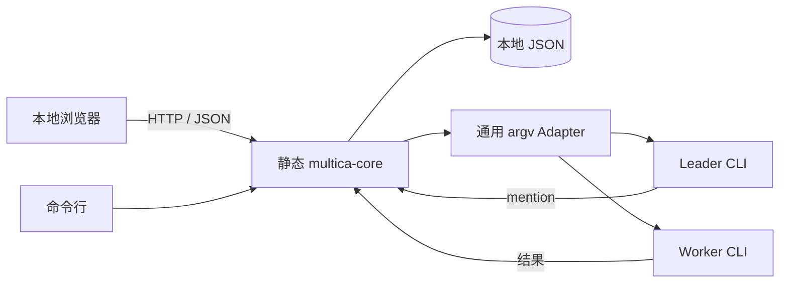
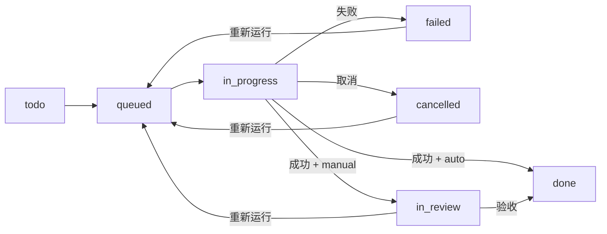

# Multica Mini 离线核心版设计说明

## 产品边界

Multica Mini 是一个单机、离线优先的多智能体任务协作台。一个静态 Linux 二进制同时
提供本地 JSON 存储、Agent 进程执行、Squad Leader 调度、HTTP API 和 Web 静态资源。

它保留完成协作任务所需的管理和运维能力，删除账号、计费、Inbox、独立 Chat、
Project、移动端、外部平台集成、远程 daemon、Autopilot 和 provider 专用配置层。
本项目不实现 Plan Mode、Ask Gate 或自动收集 workflow/skill。

## 完整工作链

```text
创建 Agent → 测试 Agent → 创建 Squad → 创建 Issue → 后台执行
→ 查看 Run 与评论 → 自动完成或人工验收 → 失败后重试 → 导出备份
```

Issue 可以交给单个 Agent，也可以交给 Squad。正常任务默认采用 `auto`，执行成功后进入
`done`。选择 `manual` 时，成功后才进入 `in_review`。

Squad 执行顺序如下：

1. Leader 读取 Issue、历史评论、成员角色和 skill 摘要。
2. Leader 用 `[@名称](mention://agent/ID)` 指定花名册中的 Worker。
3. 程序按 mention 顺序串行执行本轮 Worker。
4. Worker 输出成为同一 Issue 的评论和 Run 记录。
5. 程序重新唤醒 Leader；Leader 可以继续派发。
6. Leader 不再产生有效 mention 时，其回复成为最终结论。

首版采用稳定的串行调度。每个 Issue 设有最大 Run 数，避免 Agent 反复 mention 形成死循环。

## 架构



服务固定监听 `127.0.0.1`。Web 页面不加载 CDN、在线字体或外部脚本。

## 数据模型和恢复

```text
<data-dir>/
├── meta.json
├── sequence.json
├── agents/<agent-id>.json
├── squads/<squad-id>.json
├── issues/<issue-id>.json
├── runs/<run-id>.json
└── backups/*.json
```

实体使用同目录临时文件加原子替换写入。`meta.json` 保存 schema version，启动时自动迁移
旧数据。服务启动时会把遗留的 `running` Run，以及 `queued`、`in_progress` Issue 标记
为失败并写入原因，使异常退出后的状态可以诊断和重新运行。

同一进程内的写操作串行执行，读请求可以在 Agent 运行期间读取文件状态。一个 Issue
执行期间，其他写请求会等待其结束；取消请求通过独立的进程状态表生效。不要让两个
服务进程同时写同一个数据目录。

数据导入会先在 `<data-dir>/backups/` 写入当前数据的完整快照。运行中有任务时拒绝导入。

## Agent Adapter

Agent 命令保存为字符串数组，通过 `fork` 和 `execvp` 直接启动，不经过 shell。支持：

| 占位符 | 内容 |
| --- | --- |
| `{prompt}` | 任务、评论、职责、小队花名册和 skill 文件内容组成的完整提示 |
| `{cwd}` | Issue 工作目录 |
| `{issue_id}` | 当前 Issue ID |
| `{agent_id}` | 当前 Agent ID |

若 argv 没有 `{prompt}`，提示会自动追加到末尾。每次调用保存实际展开后的命令摘要和提示
快照。Agent 的 stdout 与 stderr 合并捕获，最多保存 4 MiB。

每个 Issue 可以配置 1 至 86400 秒超时以及 0 至 10 次失败重试。子进程在独立进程组中
运行；超时或取消时先发送 `SIGTERM`，两秒后仍未退出则发送 `SIGKILL`，以清理 Agent
产生的子进程。每次尝试都有独立 Run。

## Issue 状态



`POST /run` 只负责校验、落盘为 `queued` 并返回 HTTP 202。执行发生在服务后台，浏览器
轮询状态，不需要保持长连接。失败原因保存在 Issue 的 `last_error` 和对应 Run 中。

## Web 能力

- Agent：创建、详情、编辑、启停、连接测试和引用保护删除；
- Squad：创建、详情、Leader 与成员完整编辑、成员职责和引用保护删除；
- Issue：创建、搜索、详情、编辑、复制、评论、运行、取消、状态修改和删除；
- Run：状态、触发原因、退出码、失败原因、输出、命令和提示快照；
- 数据：数据目录显示、导出和导入；
- 设置：亮色、暗色、跟随系统。

修改 Agent 后应先保存，再执行连接测试，因为测试使用服务端已保存的命令。创建 Issue
时只显示当前可运行的 Agent 和 Squad；停用 Agent、空 Squad 或停用成员会在界面显示
原因。

## HTTP API

| 方法 | 路径 | 用途 |
| --- | --- | --- |
| GET | `/api/health` | 健康检查和版本 |
| GET | `/api/state` | Agent、Squad、Issue、Run 和数据目录 |
| GET | `/api/export` | 下载完整数据 JSON |
| POST | `/api/import` | 备份后导入完整数据 JSON |
| POST | `/api/agents` | 创建 Agent |
| GET | `/api/agents/:id` | 查看 Agent |
| PUT | `/api/agents/:id` | 编辑 Agent |
| DELETE | `/api/agents/:id` | 安全删除 Agent |
| POST | `/api/agents/:id/test` | 测试已保存的 Agent 配置 |
| POST | `/api/squads` | 创建 Squad |
| GET | `/api/squads/:id` | 查看 Squad |
| PUT | `/api/squads/:id` | 完整编辑 Squad |
| DELETE | `/api/squads/:id` | 安全删除 Squad |
| POST | `/api/squads/:id/members` | 追加成员 |
| POST | `/api/issues` | 创建 Issue |
| GET | `/api/issues/:id` | 查看 Issue、评论和 Run |
| PUT | `/api/issues/:id` | 编辑 Issue |
| DELETE | `/api/issues/:id` | 删除 Issue 及其 Run |
| POST | `/api/issues/:id/comments` | 添加人工评论 |
| POST | `/api/issues/:id/status` | 修改状态 |
| POST | `/api/issues/:id/run` | 排队运行，返回 HTTP 202 |
| POST | `/api/issues/:id/cancel` | 取消正在运行的 Issue |

API 错误返回 JSON：`{"error":"具体原因"}`。这是仅监听本机的单用户 API，没有鉴权，
不应暴露到公网。

## 离线交付

正式二进制使用 musl 全静态构建，目标为 CentOS 7、RHEL 8 及兼容的 x86_64 Linux。
包内包含二进制、Web 资源、文档、启动/服务/安装/卸载脚本、许可证以及逐文件和压缩包
SHA-256。

```sh
./scripts/build.sh
./tests/smoke.sh
./tests/web-smoke.sh
./tests/reliability-smoke.sh
./scripts/package.sh
```

验证包括 CLI 协作闭环、HTTP CRUD、自动和人工完成、失败重试、超时、取消、导入导出、
异常退出恢复、解压运行、安装、后台服务以及默认保留数据的卸载。

Multica Mini 本体不需要宿主机 glibc、Node.js、Python、Go、Docker 或数据库。被调用的
Agent CLI 可能有自己的运行库、模型账号或网络要求，这些不由本包提供。

## 许可证

本项目基于 [Multica](https://github.com/multica-ai/multica)，分发时携带完整 `LICENSE`
和 `NOTICE`。仓库和离线包同时携带 cpp-httplib、nlohmann/json 的第三方许可证说明。
