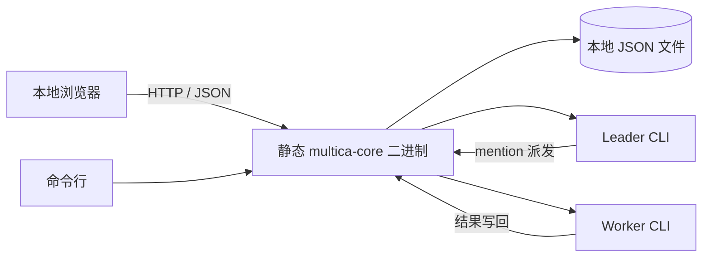

# Multica Core Offline 设计与使用说明

## 项目定位

Multica Core Offline 是 Multica 的单机离线裁剪版。它保留任务、智能体、小队和
leader 派发组成的最小协作闭环，用一个静态 Linux 二进制提供调度、JSON API 和本地
Web 界面。

它适合无法部署 PostgreSQL、Redis、Node.js、Docker 或 Kubernetes 的内网机器，也适合
CentOS 7、RHEL 8 等较老的 x86_64 Linux 系统。模型和智能体 CLI 由使用者自行准备，
本程序负责组织任务、构造提示、启动进程并保存结果。

本项目没有实现此前讨论的 Plan Mode、Ask Gate 或自动收集 workflow/skill 方案。

## 保留的协作闭环

1. 用户登记智能体的 ID、职责、命令和 skill 文件。
2. 任务可以直接分配给一个智能体，也可以分配给小队。
3. 小队 leader 先读取任务、评论、成员职责和 skill 摘要。
4. Leader 使用标准 mention 选择成员：

   ```text
   [@Worker](mention://agent/worker)
   ```

5. 程序启动被选择的成员，并把 stdout、stderr 合并保存为评论和运行记录。
6. 成员返回后，程序重新唤醒 leader。
7. Leader 不再派发成员时，任务进入 `in_review`，等待人工标记为 `done`。

直接分配给单个智能体的任务在执行成功后进入 `in_review`。执行失败会保存失败记录，
任务回到 `todo`。

## 架构



服务固定监听 `127.0.0.1`。Web 页面不加载 CDN、字体、脚本或其他在线资源。

## 数据目录

```text
<data-dir>/
├── agents/<agent-id>.json
├── squads/<squad-id>.json
├── issues/<issue-id>.json
├── runs/<run-id>.json
└── sequence.json
```

实体以临时文件加原子替换的方式写入。HTTP 服务内的写操作串行执行，读取请求可以在
智能体运行期间继续查看 `in_progress` 和 `running` 状态。

这是单进程、单机设计。不要让两个 `multica-core` 进程同时写同一个数据目录。

## 智能体命令

智能体命令保存为 argv 数组，通过 `fork` 和 `execvp` 直接启动，不经过 shell。
以下占位符会在执行前替换：

| 占位符 | 内容 |
| --- | --- |
| `{prompt}` | 任务、历史评论、职责、小队花名册和 skill 内容组成的完整提示 |
| `{cwd}` | 任务的工作目录 |
| `{issue_id}` | 当前任务 ID |
| `{agent_id}` | 当前智能体 ID |

命令没有包含 `{prompt}` 时，程序会把提示作为最后一个参数追加。每次运行最多捕获
4 MiB 输出。

## Web 和 API

运行：

```sh
./start.sh
```

然后访问 `http://127.0.0.1:30420`。页面支持：

- 登记智能体和 skill，点击智能体卡片查看及编辑配置；
- 创建小队、选择 leader、添加成员；
- 创建、筛选和查看任务；
- 启动智能体协作；
- 查看评论时间线和运行记录；
- 手动修改任务状态。
- 在亮色、暗色和跟随系统三种界面主题之间切换。

界面主题属于本应用的本地显示偏好，保存在浏览器 `localStorage` 中，不会进入任务
提示或写入任何 skill。

页面调用以下 API：

| 方法 | 路径 | 用途 |
| --- | --- | --- |
| GET | `/api/health` | 健康检查和版本 |
| GET | `/api/state` | 获取全部本地状态 |
| POST | `/api/agents` | 登记智能体 |
| GET | `/api/agents/:id` | 获取单个智能体配置 |
| PUT | `/api/agents/:id` | 编辑智能体名称、职责、命令和 skill |
| POST | `/api/squads` | 创建小队 |
| POST | `/api/squads/:id/members` | 添加小队成员 |
| POST | `/api/issues` | 创建任务 |
| GET | `/api/issues/:id` | 获取任务、评论和运行 |
| POST | `/api/issues/:id/run` | 执行任务 |
| POST | `/api/issues/:id/status` | 修改任务状态 |

`run` API 是同步请求，连接会保持到本轮协作完成。浏览器会在等待期间继续刷新状态。

## 离线包与安装

发行包解压后无需安装：

```sh
tar -xzf multica-core-offline-0.1.0-linux-x86_64.tar.gz
cd multica-core-offline-0.1.0-linux-x86_64
./start.sh
```

`start.sh` 默认把数据写入解压目录的 `data/`，也可以覆盖：

```sh
./start.sh --data-dir /srv/multica-mini/data --port 30420
```

安装到用户目录：

```sh
./install.sh --prefix "$HOME/.local" --data-dir "$HOME/.local/share/multica-core"
"$HOME/.local/bin/multica-core" serve
```

## 构建与验证

仓库包含 cpp-httplib 和 nlohmann/json 源码。构建脚本优先使用仓库内或相邻目录中的
musl 交叉工具链，也接受环境变量 `CXX` 和 `STRIP`。没有 musl 工具链时会回退到
系统 C++17 编译器并继续尝试全静态链接。

```sh
./scripts/build.sh
./tests/smoke.sh
./tests/web-smoke.sh
./scripts/package.sh
```

正式离线二进制使用 musl 构建。验证结果为：

- ELF 64-bit x86-64；
- static PIE；
- `ldd` 输出 `statically linked`；
- ELF 动态段没有 `NEEDED` 项；
- CLI leader → worker → leader 闭环通过；
- Web 静态资源和全部 JSON API 闭环通过；
- 解压直接运行和安装后运行通过。

当前压缩包约 832 KiB，二进制约 2.1 MiB。运行程序本身不需要 glibc、Node.js、
Python、Go、Docker 或数据库。实际处理任务仍需要相应的智能体 CLI 及其依赖。

## 与完整 Multica 的区别

裁剪版没有账号、工作区、权限、通知、Chat、Inbox、Autopilot、Project、外部集成、
插件、远程 daemon、对象存储和 26 个 provider 适配层。它使用通用 argv 适配器，并将
状态保存在本机文件中。

完整 Multica 适合多用户服务和完整产品体验；本项目专注于老系统上的单机离线协作。

## 许可证

本项目基于 [Multica](https://github.com/multica-ai/multica)，分发时携带完整
`LICENSE` 和 `NOTICE`。Multica License 包含对第三方托管服务和嵌入商业产品的
附加限制。仓库和离线包同时携带 cpp-httplib、nlohmann/json 的第三方许可证说明。
